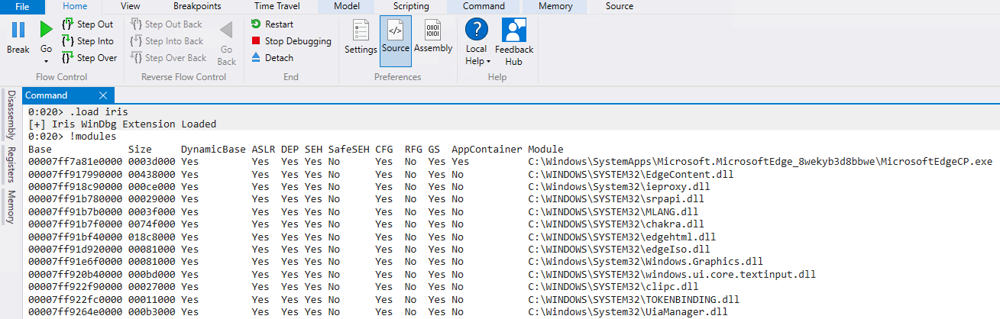

# Iris WinDbg Extension

`Iris` WinDbg extension performs detection of common Windows process mitigations (32 and 64 bits).




The checks implemented, as can be seen in the screenshots above, are:

#### for the current process

- [x] DEP Policy
  - [x] DEP ATL Thunk Emulation Disabled
  - [x] Permanent DEP Enabled
- [x] ASLR Policy
  - [x] Bottom Up Randomization Enabled
  - [x] Force Relocate Images Enabled
  - [x] High Entropy Enabled
  - [x] Stripped Images Disallowed
- [x] Arbitrary Code Guard (ACG) Policy
  - [x] Dynamic Code Prohibited
  - [x] Allow Threads to Opt Out of the restrictions on ACG
  - [x] Allow Non-AppContainer Processes to Modify all of the ACG settings for the calling process
- [x] System Calls Policy
  - [x] Win32k System Calls Disallowed
- [x] Control Flow Guard Policy
  - [x] Control Flow Guard Enabled
  - [x] Exported Functions Treated as Invalid Indirect Call Targets
  - [x] Strict Mode
- [x] Image Load Signature Policy
  - [x] Microsoft Signed Only
  - [x] Store Signed Only
  - [x] Prevent Image Loading not signed by MS, Store, or WHQL
- [x] Process Fonts Policy
  - [x] Prevent the Process from Loading Non-System Fonts
  - [x] Log ETW event when the Process Attempts to Load a Non-System Font
- [x] Process Image Load Policy
  - [x] Prevent Loading Images from a Remote Device
  - [x] Prevent Loading Images Written by Low Integrity Level
  - [x] Prefer for Images to Load in System32 subfolder
- [x] Mitigation Options
  - [x] Enable SEH overwrite protection (SEHOP)
  - [x] Heap terminate on corruption Enabled
  - [x] Win32k System Calls Disallowed Always On

#### for the loaded modules

- [x] DynamicBase 
- [x] ASLR 
- [x] DEP 
- [x] SEH 
- [x] SafeSEH 
- [x] CFG
- [x] RFG
- [x] GS
- [x] AppContainer

If you don't know the meaning of some of the keywords above use google, you'll find better explanations than the ones I could give you.

## Setup

To "install", copy either `x86\iris.dll` or `x64\iris.dll` into the `winext` folder for WinDbg (for `x86` and `x64`).

### WinDbg 10.0.xxxxx

Unless you installed the debug tools in a non standard path you'll find the `winext` folder at:

```
C:\Program Files (x86)\Windows Kits\10\Debuggers\x64\winext
```

Or, for 32 bits:

```
C:\Program Files (x86)\Windows Kits\10\Debuggers\x86\winext
```

### WinDbg Preview

Unless you ~installed~ copied WinDbg preview install folder into a non standard location you'll have it in a folder with a name close to the one below (depending on the installed version):

```
C:\Program Files\WindowsApps\Microsoft.WinDbg_1.1906.12001.0_neutral__9wekib2d8acwe
```

For 64 bits copy `x64\iris.dll` into `amd64\winext` or `x86\iris.dll` into `x86\winext` for 32 bits.

### Load the extension

After the steps above, just load the extension with `.load iris` and run `!iris.help` to see the available command(s).

```
0:014> .load iris
[+] Iris WinDbg Extension Loaded
0:014> !iris.help

IRIS WinDbg Extension (rui@deniable.org). Available commands:
	help                  = Shows this help
	modules               = Display process mitigations for all loaded modules.
	mitigations           = Display current process mitigation policy.
```

## Running

As shown in the screenshot above, just run: `!iris.modules` or simply `!modules`, and `!iris.mitigations` or simply `!mitigations`.

## Warning

**Don't trust blindly on the results, some might not be accurate**. I pretty much used as reference [PE-bear parser](https://github.com/hasherezade/bearparser/), [winchecksec](https://github.com/trailofbits/winchecksec/), [Process Hacker](https://github.com/processhacker/processhacker), [narly](https://github.com/d0c-s4vage/narly/), and [checksec-win](https://github.com/wmliang/checksec-win). Thank you to all of them.

I put this together in a day to save some time during a specific assignment. It worked for me but it hasn't been thoroughly tested. You have been warned, use at your own risk.

I'll be updating and maintining this, so any issues you may find please let me know. I plan to add a few more mitigations later.

## References

Besides the references mentioned before, if you want to write your own extension (or contribute to this one) the [Advanced Windows Debugging](https://archive.codeplex.com/?p=awd) book and the WinDbg SDK are your friends.
